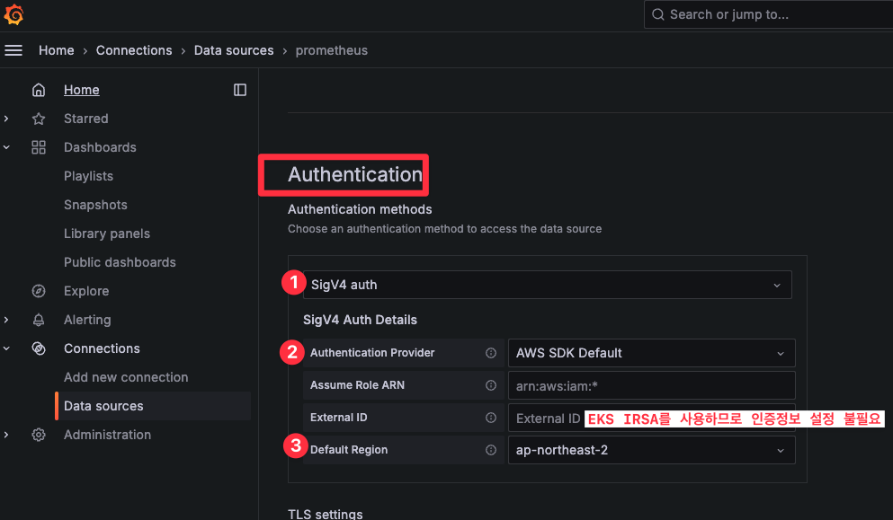

# 개요
* EKS와 Amazon prometheus 연동

# 전제조건
* EKS authentication가 API 모드(참고자료: https://malwareanalysis.tistory.com/728)


# 그라파나 생성 방법

1. helm repo 추가

```sh
helm repo add grafana https://grafana.github.io/helm-charts
helm repo update
```

2. grafana helm chart 릴리즈

* [values.yaml](../argocd_bootstrap/bootstraps/helm_values/grafana.yaml)에서는 aws siv4와 IRSA를 설정해야 함

```sh
helm upgrade --install -f valeus.yaml -n monitoring grafana grafana/grafana
```

3. ingress 생성 확인과 그라파나 접속

```sh
kubectl -n monitoring get ingress
```

3. admin 초기 비밀번호

```sh
kubectl -n monitoring get secrets grafana -oyaml -o jsonpath="{.data.admin-password}" | base64 -d; echo
```

# 그라파나 <-> AMP 연동방법

* IRSA가 설정되야 그라파나 pod가 AMP연결할 수 있음
* IRSA IAM policy는 [테라폼 코드](../eks/module/eks/grafana_iam.tf) 참고





# 참고자료
* https://medium.com/@biswanath.ita/simplified-observability-for-amazon-eks-with-the-new-amazon-managed-service-for-prometheus-3d97d14ecad0
* https://blog.bespinglobal.com/post/amazon-managed-prometheus/
* https://docs.aws.amazon.com/prometheus/latest/userguide/AMP-onboard-query-grafana-7.3.html#AMP-onboard-query-grafana-7.3-IRSA
* AMP IAM policy: https://docs.aws.amazon.com/prometheus/latest/userguide/set-up-irsa.html#set-up-irsa-query
