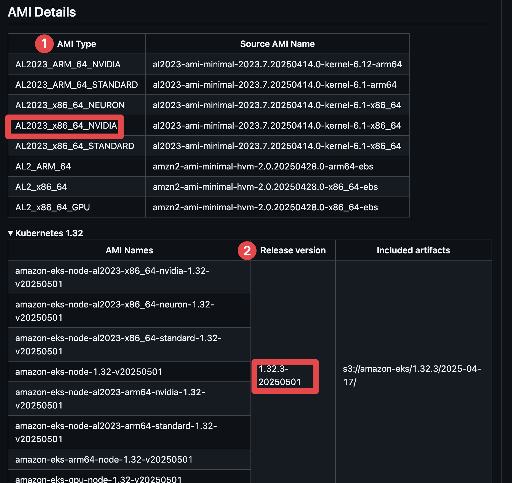

# Managed node group 설정 예

> terraform.tfvars에 설정

* 기본

```hcl
managed_node_groups = {
  "managed-node-group-a" = {
    node_group_name = "managed-node-group-a",
    instance_types  = ["t3.medium"],
    capacity_type   = "ON_DEMAND",
    release_version = "1.32.3-20250501",
    disk_size       = 20,
    desired_size    = 1,
    max_size        = 1,
    min_size        = 1
  }
}
```

* labels과 taint 설정

```hcl
managed_node_groups = {
  "managed-node-group-b" = {
    node_group_name = "managed-node-group-b",
    instance_types  = ["t3.medium"],
    capacity_type   = "ON_DEMAND",
    release_version = "1.32.3-20250501",
    disk_size       = 20,
    desired_size    = 1,
    max_size        = 1,
    min_size        = 1,
    labels         = {
      "node-type" = "managed-node-group-b"
    }
    taints = [
      {
        key    = "node-type"
        value  = "managed-node-group-b"
        effect = "NO_SCHEDULE"
      }
    ]
  }
}
```

# AMI_ID와 release_version 관계

* ami_id가 설정되면 release_version은 무시됩니다. 즉, ami_id가 더 우선순위가 높습니다.

# GPU managed node group 생성 방법

1. EKS GPU optimized AMI 검색

```sh
EKS_VERSION=1.32
REGION=ap-northeast-2
GPU_TYPE=nvidia
aws ssm get-parameter --name /aws/service/eks/optimized-ami/$EKS_VERSION/amazon-linux-2023/x86_64/$GPU_TYPE/recommended/image_id \
    --region $REGION --query "Parameter.Value" --output text
```

2. managed node group 설정

* terraform.tfvars의 managed_node_group에 gpu 노드 설정을 추가합니다.
  * release_version: EKS AMI github 릴리즈에서 확인한 값
  * ami_type: AL2023_x86_64_NVIDIA
  * taint와 label설정



```hcl
managed_node_groups = {
  "managed-node-group-gpu-a" = {
    node_group_name = "managed-node-group-gpu-a",
    instance_types  = ["g6.xlarge"],
    capacity_type   = "ON_DEMAND",
    # EKS nvidia GPU optimized AMI
    release_version = "1.32.3-20250501",
    ami_type      = "AL2023_x86_64_NVIDIA",
    disk_size       = 20,
    desired_size    = 1,
    max_size        = 1,
    min_size        = 1,
    labels = {
      "nvidia.com/gpu" = "true"
    }
    taints = [
      {
        key    = "nvidia.com/gpu"
        value  = "true"
        effect = "NO_SCHEDULE"
      }
    ]
  },
}
```

