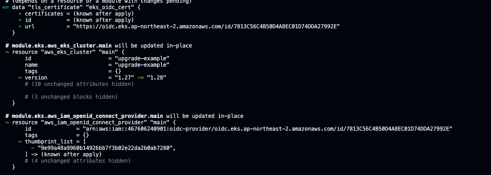
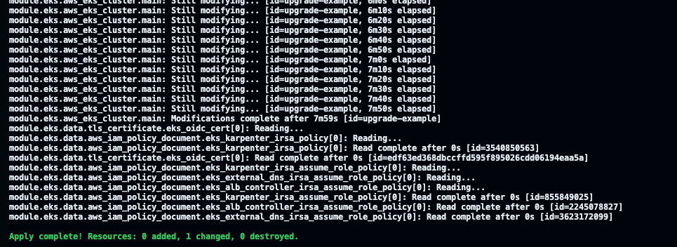
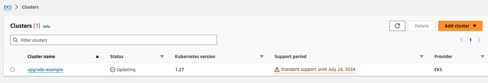
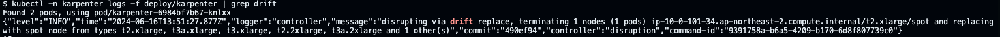
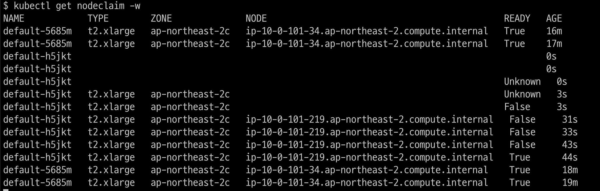
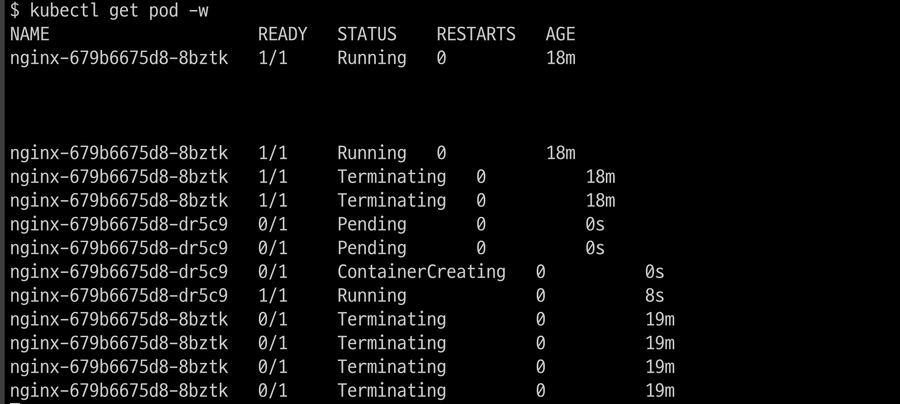

# 업그레이드 과정 기록

* control plane이 업그레이드 되면 OIDC connect가 재생성된다. pod를 재부팅하지 않아도 IRSA가 잘 인식된다.

* AWS console에서는 updating으로 표시된다.

* 업그레이드 하는 동안 기존 pod는 영향을 미치지 않는다.

* [karpenter EC2NodeClass](./manifests/nodepool/nodeclass.yaml) amiSelectorTerms필드를 정의하지 않으면, karpenter로 생성한 pod는 EKS버전에 맞는 최신 AMI로 교체된다. 이 과정을 drift라고 부른다.
* 단, pod에 probe설정과 graceful shutdown이 올바르게 설정되야 무중단으로 drift된다.
* drift가 되면 [karpenter pod 로그](./karpenter_pod_logs.log)에 drift라고 표시된다.

# 참고자료
* https://aws.amazon.com/ko/blogs/containers/how-to-upgrade-amazon-eks-worker-nodes-with-karpenter-drift/
